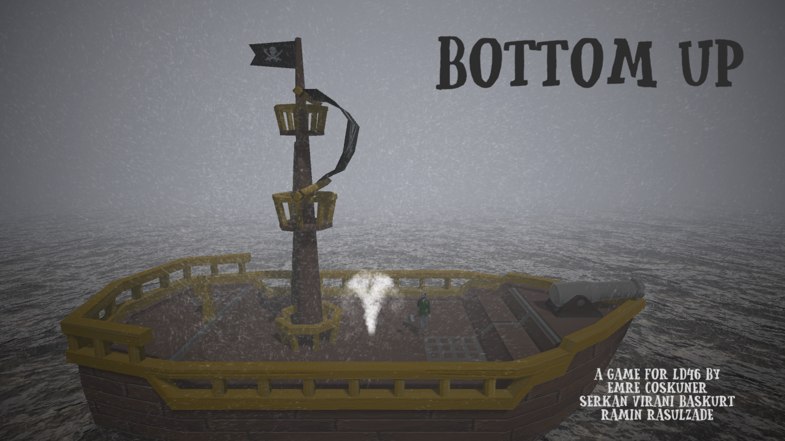

# LudumDare46

Ludum Dare 46 Submission:

https://ldjam.com/events/ludum-dare/46/bottom-up

You are sailing in a stormy day. You already know it is a bad idea.

But wait! What was that? Did you see what I saw? Things couldn’t be worse!

Hurry! Fix the holes and repair your ship before you end up in davy jones’s locker!

Controls:

WASD-Control.

R-Repair.​

Space-Jump( It has no function, but I know you want to jump unnecessarily.)

Dev-Notes: I challenged myself for learning procedural animation in this jam. I know there are problems, but pls consider that it was the first step. As a last word, Quaternions suck!

Have fun.

Try it out: https://srknvrnbskrt.itch.io/bottom-up

